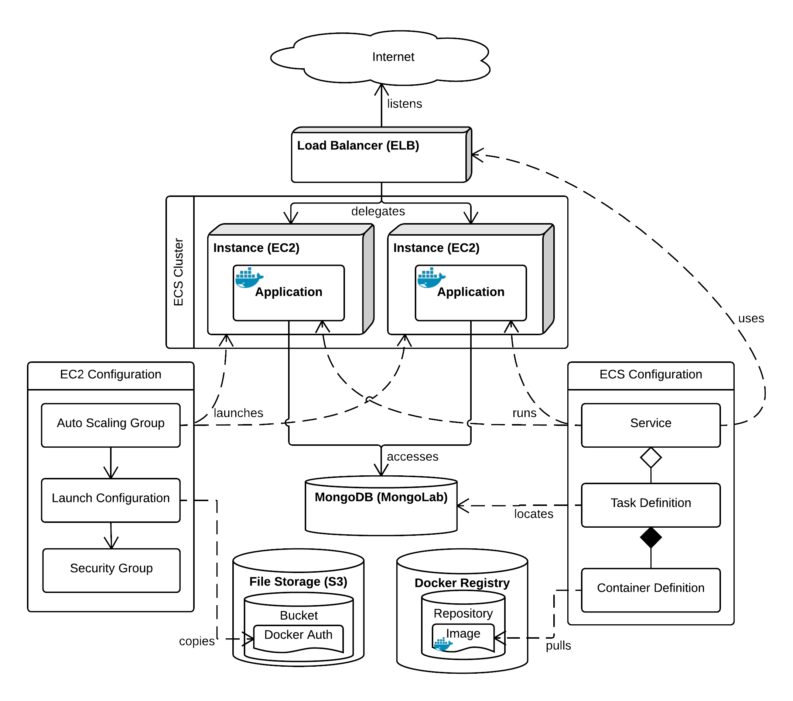

# Infrastructure

**Infrastructure** is the set of services that your application runs on top of. This typically includes computing, data storage and networking.

In this chapter, we will explore the key infrastructure services that AWS provides. Each one gets a brief introduction, followed by instructions to configure it. We also pay special attention to flagging common errors that can occur along the way, and how to fix them.

By the end of the chapter, you will set up all of the services you need and deployed your app onto them. Once it's up and running, it will keep running forever! In later chapters, we'll cover how to automate application updates and debug problems that may occur.

But for now, let's make a start!

## System Architecture

**System architecture** is a loosely-defined term. In essence it refers to the primary components of your system that are difficult to change. These tend to be components that are not subsystems of other components.

Here's an **architectural design diagram** of the system that we're going to build. As you proceed through the following sections, you'll see it come together piece by piece.

