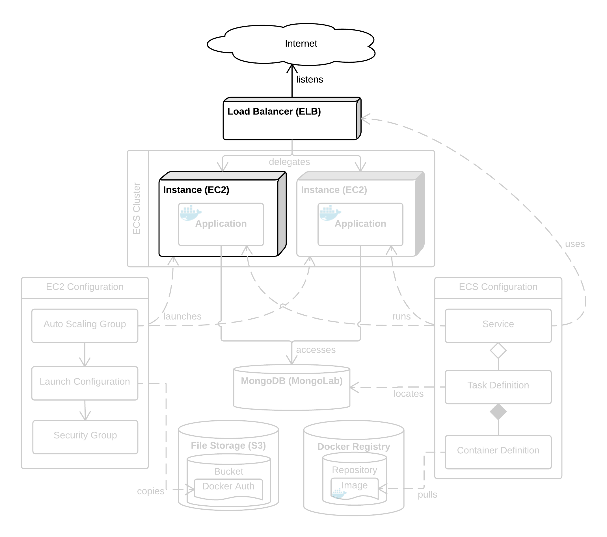

# EC2 Elastic Load Balancers

Along with [Auto Scaling Groups](auto-scaling-groups.md), Elastic Load Balancers are the magic that makes AWS scale so effortlessly.

A load balancer is a kind of **reverse proxy**. Rather than connecting directly to your application's instance, you force your users to connect to the load balancer instance instead. Acting as a proxy, the load balancer forwards the request onto an application instance, and returns the response from that instance. The upshot is that the behaviour is transparent to the user, but grants you the ability to route the request within your cloud.

In summary, an ELB instance lets you distribute incoming requests across multiple instances, optionally changing ports and handling SSL as well. This ultimately grants you a lot of flexibility and scalability.

For each request, an ELB does the following things:

1. Listens for and receives the request to its own IP address.
1. Maps the port of the request (typically 80 or 443) onto a port for the instance (can be anything).
1. Selects one of the EC2 instances registered with it.
1. Terminates SSL, decrypting the request.
1. Forwards the request to that instance (using the mapped host port).
1. Waits for a response from the instance, encrypts it with SSL, then forwards it back to the client.

The first four steps are small but important. We'll walk through each of them to explain. If you just want to get on with it, skip to the bottom.

## IP Address

Behind the scenes, an ELB instance is just an EC2 instance running a load balancer program. As such, it has its own IP address just as an EC2 instance does. To use the ELB, you want to direct all your users to the ELB's IP address and let it route those requests. This is done by mapping your application's domain name onto the ELB IP address with an A Record.

## Port Mapping

Each ELB instance can be configured with multiple many-to-one port mappings. This means each port on the ELB instance can be forwarded to any port on the EC2 instances. Typically you will map ELB port 443 (if you're using SSL) or 80 (if not) onto your application's port (e.g. 3000, 5000 or 8080).

Note that one ELB port cannot map onto multiple instance ports. This means it's not straightforward to load balance across multiple instance of an application on the same EC2 instance. A simpler solution is to run one application instance per EC2 instance and just use more smaller EC2 instances.

## Instance Selection

EC2 instances are registered with an ELB. When an ELB receives a request, it selects an EC2 instance to forward the request to. This is based on the load each instance is under.

An ELB will also monitor the health of its EC2 instances. If an instance becomes unhealthy, the ELB will stop forwarding requests to it. Health checks send a request to a custom port and path of the instance and expect a successful response. This allows the application to run its own health check logic. The default health check is to simply request `/index.html` on port 80.

## SSL Handling

We discussed the fundamentals of SSL certificates in [IAM Certificates](../iam/certificates.md). After that configuration, securing an ELB with SSL is as simple as selecting from a dropdown menu.

## What should I do?

1. Create a new ELB instance.
1. Map Load Balancer port 443 to Instance port 3000.
1. Select a security group that allows only port 443.
1. Select the SSL certificate [registered earlier](../iam/certificates.md).
1. Configure a basic health check to ping port 3000 with path `/`.
1. Don't worry about adding EC2 instances, since an [Auto Scaling Group](auto-scaling-groups.md) will manage this.
1. Don't bother with tags.
1. Review and create the ELB.

The ELB is now ready to accept requests, but it doesn't yet have any EC2 instances to forward them to. Let's rectify this by setting up an [Auto Scaling Group](auto-scaling-groups.md).

## See Also

There are multiple high-quality open-source reverse proxy/load balancer tools available:

* [nginx](http://nginx.org/en/) (pronounced "engine x")
* [HAProxy](http://www.haproxy.org/)

You can use these tools to replicate the functionality of ELB. This will grant you more flexibility and may be cheaper, but require more expertise, configuration and maintenance.

Both nginx and HAProxy include native support for SSL termination. There are also other tools that do this job, such as [stud](https://github.com/bumptech/stud).
