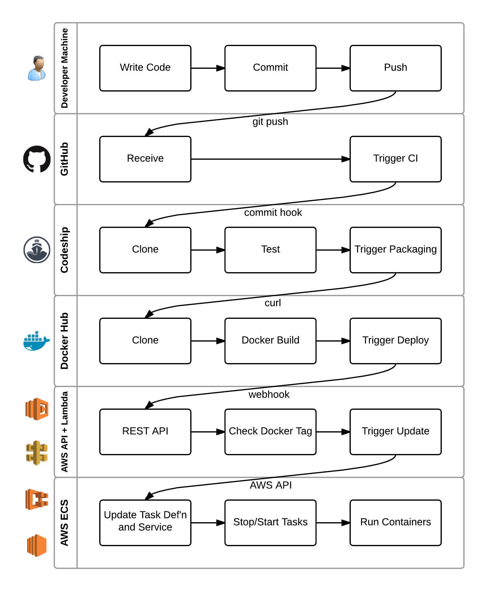

# Continuous Delivery

The purpose of this book is not just to deploy an application on a scalable infrastructure. We also want to deploy it with a scalable *process* that makes it easy to continue developing and re-deploying the code. In particular, the whole process should be almost entirely automated. A simple `git push` should be enough to update the app in production.

This capability (and the processes that support it) is called **Continuous Delivery** (CD). Martin Fowler describes the concept in much more detail. Note that this is different from Platform-as-a-Service (PaaS) tools like [Heroku](https://heroku.com). It's not just the automation, but *what* is automated. Individual tools and vendors are just links in a larger pipeline.

## The Process

A continuous delivery pipeline transforms source code through a number of stages. This includes, but is not limited to:

1. **Version control**: The source code is the app. It should be stored in a central repository from which the rest of the process can begin.

1. **Build**: The app can't be run until the source code is compiled into an executable format. Even interpreted languages like JavaScript will often have a build step to optimise the code, compile the documentation, and so on.

1. **Test**: Every time a change to the source code is integrated, the full suite of automated tests should be run. This helps detect bugs before they reach the end users.

1. **Package**: Working, successfully tested code is ready to run. However it may need further transformation to run in the production environment. These days it is common to package the executable app in a Docker image to isolate it from the environment of whatever platform it is deployed onto.

1. **Deploy**: Finally, the packaged app is deployed ("provisioned") on a production server where it handles end user requests.

1. **Scale**: There is more to a scalable app than just running in production. Chances are there are multiple instances of the old code running. Switching all of those instances to the new code without taking the app offline requires some further logic.

At a very high level, the goal of continuous delivery is to automate that entire pipeline. If everything happens automatically, then teams can quickly and confidently release multiple times every day. End users will receive new functionality faster, and developers will have fewer support requests and less old code to maintain. It's a win-win.

In this book, we will walk through the continuous delivery process illustrated below. Tools outside of AWS are used to work with the source code, then AWS automates the deployment and scaling. The result is an elegant, scalable system that leaves control in the developer's hands: each component can be modified and replaced as needed.

## What should I do?

1. Sign up for accounts with GitHub, Codeship, Docker Hub and AWS. We'll revisit each of these services in the coming chapters.
